  

  

  
  

  
  
  
  
  

  
  ---

  
<table>
  <tr>
    <td>

  ### 🚀 About Me
  - 🎓 Data Science Undergraduate at SLIIT  
  - 🌱 Learning Data Science, Android Development (Kotlin), and React
  - 🔭 Building AI applications, full-stack and mobile apps  
  - 🤝 Open to collaborations on real-world projects  
  - 💬 Ask me about MERN, Web, UI/UX, or Databases  
  - ⚡ Fun fact: Call me ManO 😉  

    </td>
    <td>
      
    </td>
  </tr>
</table>

  ---
  
  ### 🛠️ Tech Stack
  

  

  ---
  
  ### 📊 GitHub Analytics
  

    
    
  

  
  

  
  
  

  ---
  
  ### 🏆 Achievements
  

    
  

  
  ---
  
  ### 📈 Activity
  

    
  

  
  ---
  
  ### ☕ Support Me
  

    
  

  ---
  
  

    
  

  
  

    <picture>
      <source media="(prefers-color-scheme: dark)" srcset="https://raw.githubusercontent.com/Man0dya/Man0dya/output/github-contribution-grid-snake-dark.svg" />
      
    </picture>
  

    
  

  
 ---

